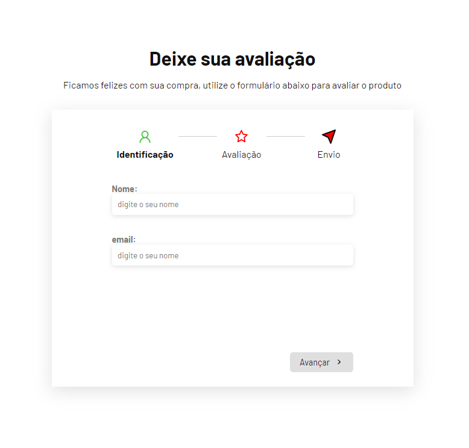

<h1>FORMULARIO-MULTISTEP</h1>
<p> O projeto realizado reproduz uma pagina de feedback ao cliente após uma compra <p/>

<h2> Imagens do projeto <h2/>

<h3> User form <h3/>

<h3> Evaluation form  <h3/>

<h3> Review summary <h3/>


## ⚙ Tecnologias e ferramentas utilizadas

- [React.JS (Vite)](https://vitejs.dev/)
- [React.JS] (React-icons)] (https://react-icons.github.io/react-icons/)

## 🔧 Uso e Clonagem 

Clone o projeto e acesse a pasta

```bash
$ git clone https://github.com/evertonvargas/ignite-lab-design-system

```

Para rodar o projeto
```
$ npm run dev
```
